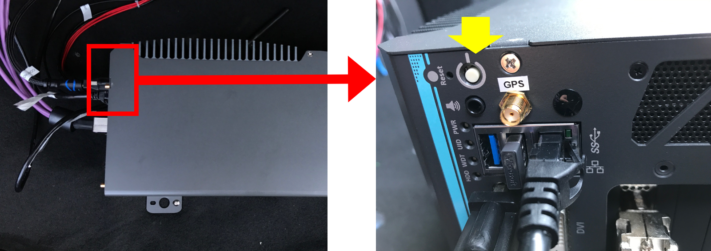
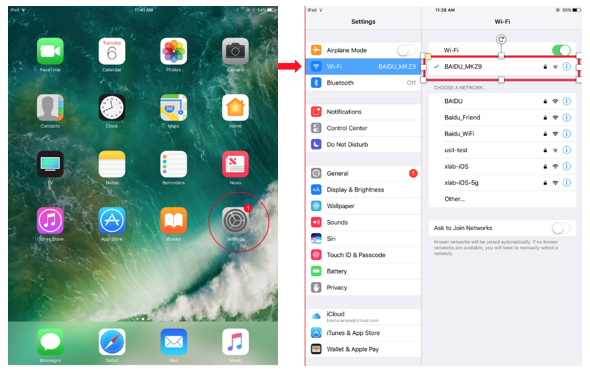
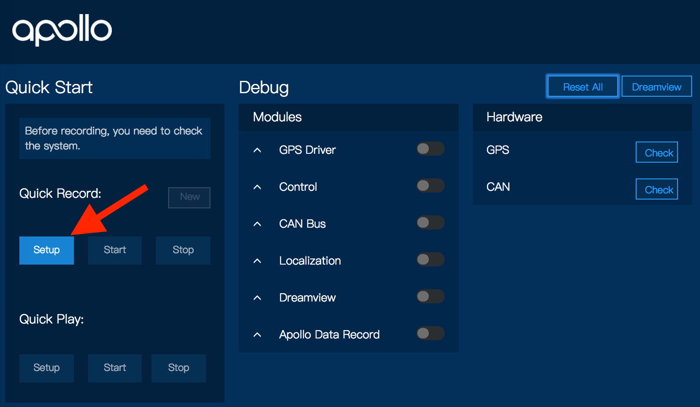
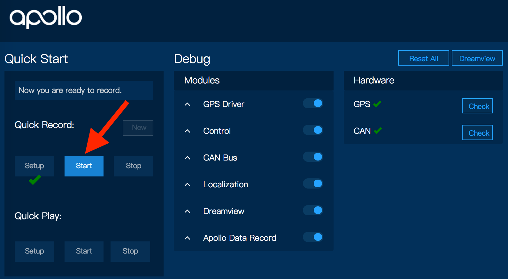
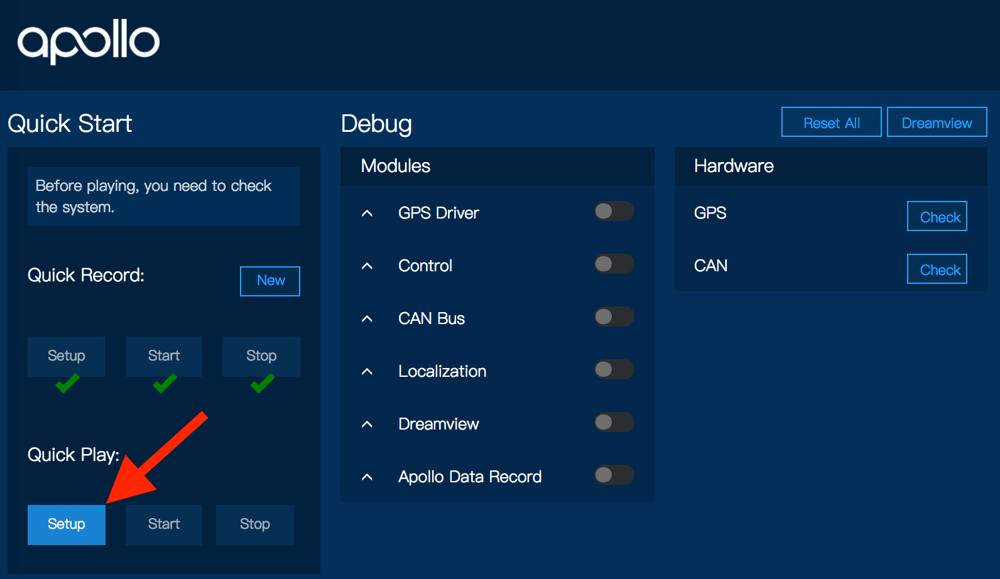

# Apollo 快速入门指南  1.0
## 目录
* [关于这个文档](#关于这个文档)
    * [文档规约](#文档规约)
* [概览](#概览)
* [车辆环境描述](#车辆环境描述)
* [硬件安装](#硬件安装)
* [软件安装](#软件安装)
    * [下载Apollo源代码](#下载Apollo源代码)
    * [设置Docker支持](#设置Docker支持)
    * [设置Apollo发布的Docker映像（image）](#设置Apollo发布的Docker映像（image）)
    * [自定义你的发布容器](#自定义你的发布容器)
* [在车辆上运行示例](#在车辆上运行示例)
    * [启动本地版本Docker映像](#启动本地版本Docker映像)
    * [记录驾驶轨迹](#记录驾驶轨迹)
    * [执行自动驾驶](#执行自动驾驶)
    * [关闭](#关闭)
* [运行离线演示](#运行离线演示)

# 关于这个文档

_Apollo 快速入门指南 1.0_ 提供了所有关于了解、安装以及构建Apollo的基本说明

## 文档规约

下表列出了本文档中使用的归约：

| **Icon**                            | **描述**                                   |
| ----------------------------------- | ---------------------------------------- |
| **粗体**                              | 重要                                       |
| `等宽字体`                              | 代码，类型数据                                  |
| _斜体_                                | 文件标题，章节和标题使用的术语                          |
|        | **Info**  包含可能有用的信息。忽略信息图标没有消极的后果        |
|          | **Tip**. 包括有用的提示或可能有助于您完成任务的捷径。          |
|    | **Online**. 提供指向特定网站的链接，您可以在其中获取更多信息     |
|  | **Warning**. 包含**不**能忽略的信息，或者执行某个任务或步骤时，您将面临失败风险 |

# 概览

Apollo已经开始为汽车和自主驾驶行业的合作伙伴提供开放，全面，可靠的软件平台。合作伙伴可以使用Apollo软件平台和通过Apollo认证的参考硬件模板来定制自己的自主车辆研发。

Apollo 1.0, 也被称为 _Automatic GPS Waypoint Following(自动GPS跟随)_, 使用在封闭的区域内，如测试轨道或停车场。它可以准确地以人类驾驶员在封闭的平坦区域的速度复现一个驾驶轨迹。

在这个开发阶段, Apollo 1.0 **无法** 察觉到邻近的障碍物, **不要**在公共道路或没有GPS信号的区域行驶。

# 车辆环境描述

The Lincoln MKZ, enhanced by Autonomous Stuff, 为用户提供了一个无障碍的自动车辆平台。该平台为用户提供了一整套硬件和软件解决方案。

用户可以直接获得车辆某些模块控制权限，如档位，速度和指示灯。平台已经为转向，刹车，加速和档位创建了接口，为开发人员提供了可使用的用户界面。

包含的其他功能:

- 电源分配器终端
- 集成PC与ROS预安装和配置
- 线控驱动的紧急停止系统
- 以太网和USB连接 (to PC)

# 硬件安装

请参考 [Apollo 1.0 Hardware and System Installation Guide](https://github.com/ApolloAuto/apollo/blob/master/docs/quickstart/apollo_1_0_hardware_system_installation_guide.md)
中的步骤来安装硬件组件以及系统软件

# 软件安装

本节包括：

- 下载Apollo发行包
- 设置Docker支持
- 自定义你的发布容器

在开始之前，请确保您已经按照
[Apollo 1.0 Hardware and System Installation Guide](https://github.com/ApolloAuto/apollo/blob/master/docs/quickstart/apollo_1_0_hardware_system_installation_guide.md)中的步骤
安装了Ubuntu Linux 14.04.3和Apollo Kernel。
## 下载Apollo源代码

1. 从[github source](https://github.com/ApolloAuto/apollo/)下载Apollo的源代码：

```
git clone git@github.com:ApolloAuto/apollo.git
cd apollo

```

2. 参考以下命令设置环境变量 `APOLLO_HOME`:

```
echo "export APOLLO_HOME=$(pwd)" >> ~/.bashrc && source ~/.bashrc
```

3. 在一个新的终端或者已有的终端中输入`source ~/.bashrc`


 在以下部分中，假设Apollo目录位于 `$APOLLO_HOME`.

## 设置Docker支持

Docker容器是设置Apollo构建环境的最简单方法。

有关更多信息，请参阅Docker详细教程 [here](https://docs.docker.com/).

1. 运行以下命令来安装Docker：


```
cd $APOLLO_HOME
bash docker/scripts/install_docker.sh
```

2. 脚本完成后，注销并重新登录系统以启用Docker。


3. （可选）如果您已经安装了Docker（在安装Apollo内核之前），请在其中添加以下行 `/etc/default/docker`:

```
DOCKER_OPTS = "-s overlay"
```

## 自定义你的发布容器

1. 通过运行以下命令下载并启动Apollo 发布的 Docker映像：

```
cd $APOLLO_HOME
bash docker/scripts/release_start.sh
```

2. 通过运行以下命令登录Apollo 发布的 Docker映像：

```
bash docker/scripts/release_into.sh
```

3. 通过修改文件中的以下行来设置全球导航卫星系统（GNSS）驱动程序的区域编号 `./ros/share/gnss_driver/launch/gnss_driver.launch`.

```
<arg name="proj4_text" default="+proj=utm +zone=10 +ellps=WGS84 +towgs84=0,0,0,0,0,0,0 +units=m +no_defs " />
```
你只需修改上面一行的`+zone=10`的值即可。请参考
[Apollo's Coordinate System](https://github.com/ApolloAuto/apollo/blob/master/docs/specs/coordination.pdf) 找到您当地的区号。例如，如果你在北京，中国，你必须设置`+zone=50`。

5. 通过修改以下文件，为GNSS驱动程序设置实时运动（RTK）基站：
   `./ros/share/gnss_driver/conf/gnss_conf_mkz.txt`

   有关典型的RTK设置，请参阅以下示例：

```
rtk_from {
	format: RTCM_V3
		ntrip {
		address: <provide your own value>
		port: <provide your own value>
		mount_point: <provide your own value>
		user: <provide your own username>
		password: <provide your own password>
		timeout_s: <provide your own value, e.g., 5>
	}
}
rtk_to {
	format: RTCM_V3
	serial {
		device: <provide your own value, e.g., "/dev/ttyUSB1">
		baud_rate: <provide your own value, e.g., 115200>
	}
}
```

 `rtk_from` 用于RTK基站信息。

 `rtk_to` 用于将RTK差分数据发送到接收器。

6. 添加ESD CAN支持

   请参考 [ESD CAN README](https://github.com/ApolloAuto/apollo/blob/master/third_party/can_card_library/esd_can/README.md)
   来设置ESD CAN库。

7. 按照以下步骤继续更改你的本地环境：

```
# RUN OUT OF DOCKER ENV
# commit your docker local changes to local docker image.
exit # exit from docker environment
cd $APOLLO_HOME
bash docker/scripts/release_commit.sh
```

# 在车辆上运行示例

本节提供运行Apollo 1.0 Demo on Vehicle的说明。
1. 设置硬件：

- 打开平台车辆
- 打开工业PC机（IPC）.
    
- 通过按住电源按钮打开调制解调器电源，直到指示灯亮起
- 设置IPC的网络配置：静态IP（例如192.168.10.6），子网掩码（例如255.255.255.0）和网关（例如192.168.10.1）
   - 配置您的DNS服务器IP（例如，8.8.8.8）。
   - 使用平板电脑访问**设置**并连接到MKZ wifi 热点：

   

2. 在Docker中使用**Chrome（只能使用Chrome）** 启动HMI：

   **Warning:** 确保您不是同时从两个Docker容器启动HMI。

## 启动本地版本Docker映像

运行以下命令：
```
cd $APOLLO_HOME
bash docker/scripts/release_start.sh local_release
```
当Docker启动时，它创建一个端口映射，将Docker内部端口8887映射到主机端口8887.然后，您可以在主机浏览器中访问HMI Web服务：

打开Chrome浏览器并启动阿波罗人机界面，转到 **192.168.10.6:8887**.
 

## 记录驾驶轨迹

按照以下步骤记录驾驶轨迹：

1. 在Apollo HMI中，在**Quick Record**下，单击**Setup**以启动所有模块并执行硬件运行状况检查。
   
2. 如果硬件健康检查通过，单击 **Start** 按钮开始记录驱动程序轨迹。
   
3. 到达目的地后，点击**Stop** 按钮停止录制。
   
4. 如果要记录不同的轨迹，请单击**New** 按钮再次开始录制。
   

## 执行自动驾驶

按照以下步骤执行自主驾驶：

1. 在Apollo HMI中，在Quick Play下，单击 **Setup** 启动所有模块并执行硬件运行状况检查。
   

2. 如果车辆顺利通过Setup这一步, 它已经准备好进入自动模式了。 **确保驾驶员准备好了！**  点击 **Start**按钮开始自动驾驶。

   

3. 到达目的地后，点击 **Stop** 按钮停止重放录制的轨迹。
   

## 关闭

1. 从终端关闭系统：
    ```sudo shutdown now```

2. 关闭IPC（找到桌面右上角的图标点击 **Shut Down**).

3. 按住电源按钮关闭调制解调器，直到指示灯熄灭。

4. 关掉车子

# 运行离线演示
参考 [Offline Demo Guide](https://github.com/ApolloAuto/apollo/blob/master/docs/demo_guide/README.md)
