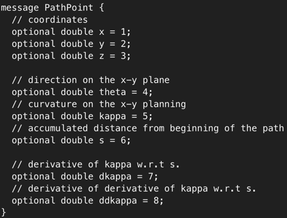
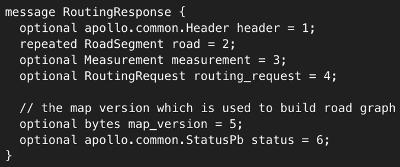
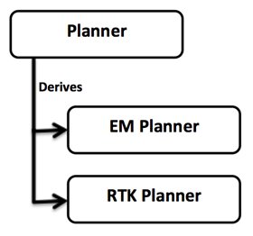

# Class Architecture and Overview

------*Planning Module*

## Planning Module Data Output and Input

### Output Data

The planning output data is defined in **planning.proto**, as shown in the following picture.

Inside the proto data definition, the planning output includes the total planned time and length, as well as the actual trajectory for control to execute, defined in “**`repeated apollo.common.TrajectoryPoint trajectory_point`**”. Each of these “**`trajectory_point`**”, as defined in “**`pnc_point.proto`**”, contains detailed attributes of the trajectory. A trajectory point is derived from a “**`path_point`**”, where speed, acceleration and timing attributes are added.

Besides the trajectory itself, the planning module also outputs rich annotating information. The important data fields are:

* Estop
* DecisionResult
* Debug information

Estop is a command which indicates errors and exceptions. For example, when the autonomous vehicle finds that it collides into other obstacles or could not obey traffic rules, estop signals will be sent. The “DecisionResult” data is mainly for simulation to display such that developers could have a better understanding of the planning results. More detailed numerical intermediate results are stored in the debug information and sent out for debugging purpose.

### Input Data

To compute the finally published trajectory, the planning module leverages various input data sources.The input of planning consists of:

1. Routing
2. Perception and Prediction
3. Vehicle Status and Localization
4. HD-Map

Routing defines “where I want to go” for the autonomous vehicle, and the message is defined in “`routing.proto`”. The “**RoutingResponse**” contains the “**RoadSegment**” which identifies the road or lanes to follow through in order to reach the destination.

The messages regarding “what are surrounding me” is mostly defined in “perception_obstacles.proto” and “`traffic_light_detection.proto`”. “`perception_obstacles.proto`” defines the obstacles perceived by the perception module around the autonomous vehicle, while “**traffic_light_detection**” defines the perceived traffic light statuses (if any). In addition to the perceived obstacles, what important for the planning module are the predicted trajectories for each perceived dynamic obstacle. Therefore, the “prediction.proto” wrapps the perception_obstacle message with a predicted trajectory, as shown below:

Each of the predicted trajectory has a probability associated with it, and one obstacle might have multiple predicted trajectories.

Besides “where I want to go” and “what is surrounding me”, another important aspect of information is “where I am”. Such information are obstained from the HD-map and Localization modules. Both localization and vehicle chassis information are incorporated in the messages of “**VehicleState**” defined in the “`vehicle_state.proto`”, as shown below.

## Code Structure and Class Hierarchy

The code is organized as follows:The planning code entrance is the planning.cc. Inside the planner, the important class members are shown in the following picture.

The “**ReferenceLineInfo**” is a wrapper of the “**ReferenceLine**” class which represents a smoothed guideline for planning. **Frame** contains all the data dependencies including the peceived obstacles with their predicted trajectories, and status regarding the autonomous vehicle itself. **HD-Map** is leveraged as a library inside the planning module for ad-hoc fashioned map queries. The actual planning work is done by the “**EM-Planner**”, which is derived from the “**Planner**” class. While “**Em-Planner**” is the one actually used in our Apollo 2.0 release, the previously released “**RTK-Planner**” is also a derivative from the “**Planner**” class.

Inside an planning cycle performed by the EM-Planner, we take an “iterative” approach (as shown in the figure below) where three categories of “tasks” interweave. The relationships of these “**decider/optimizer**” classes are shown as below.

* Deciders: traffice decider, path decider and speed decider
* Path Optimizers: DP/QP path optimizer
* Speed Optimizers: DP/QP speed optimizer

Here DP means dynamic programming while QP means quadratic programming. After the computation, the trajectory will then be discretized and published such that the downstream control module will be able to execute it.
